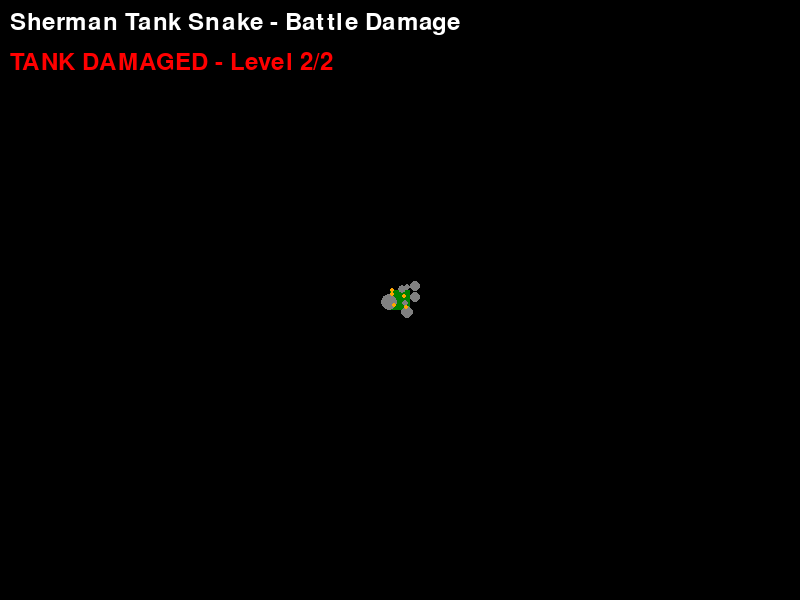
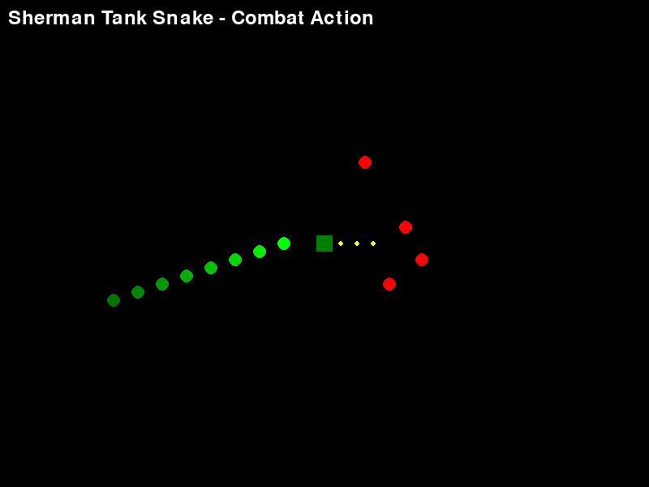

# 🎮 Building Sherman Tank Snake: My AI-Assisted Retro Game Development Journey

*How I created a unique WWII-themed hybrid game combining tank combat with snake mechanics using AI as my coding partner*

---

## 🚀 The Game That Started It All

When I set out to create a retro game, I didn't want to build just another clone. I wanted something that honored gaming history while bringing fresh mechanics to the table. That's how **Sherman Tank Snake** was born - a unique hybrid that combines the legendary M4 Sherman tank with classic snake gameplay and modern strategic elements.


*Sherman Tank Snake in action - notice the tactical trail system and fading effects*

### Why Sherman Tank Snake?

**The Vision**: What if the classic Snake game had the weight and strategy of tank warfare? What if your "snake" was actually the trail left by a legendary WWII Sherman tank, and you could use that trail tactically to trap enemies?

**The Appeal**:
- 🚗 **Historical Connection**: The M4 Sherman was one of WWII's most iconic tanks
- 🐍 **Familiar Mechanics**: Everyone knows Snake, but this adds strategic depth
- 💥 **Tactical Gameplay**: Using your trail to create traps adds a puzzle element
- 🎯 **Unique Hybrid**: I couldn't find anything quite like this combination

---

## 🧠 AI as My Development Partner: Effective Prompting Techniques

Working with AI to build this game taught me invaluable lessons about effective prompting. Here are the techniques that made the biggest difference:

### 1. **Context-Rich Problem Framing**

**❌ Ineffective Prompt:**
```
"Make a snake game with a tank"
```

**✅ Effective Prompt:**
```
"I want to create a hybrid game that combines classic Snake mechanics with WWII tank combat. The player controls a Sherman tank that leaves a trail behind it (like Snake), but the trail can be used strategically to trap enemies. The tank should have realistic rotation, the trail should fade over time, and trapped enemies should explode. Can you help me design the core game loop and tank movement system?"
```

**Why it worked**: Specific vision, clear mechanics, historical context, and defined success criteria.

### 2. **Iterative Feature Development**

Instead of asking for everything at once, I broke features into logical chunks:

```
Phase 1: "Create basic tank movement with pygame - realistic rotation and forward movement"
Phase 2: "Add a trail system that follows the tank and fades over time"
Phase 3: "Implement enemy detection when they're encircled by the trail"
Phase 4: "Add auto-trap system with visual feedback and explosions"
```

This approach led to cleaner code and fewer bugs.

### 3. **Problem-Solution Prompting**

When I encountered issues, I described both the problem AND what I'd tried:

```
"I'm having an issue where the tank's trail segments are disappearing too quickly, making it hard to create strategic traps. I've tried increasing the lifetime value, but then the trail gets too long and clutters the screen. I need a balance where the trail is visible long enough for strategy (about 5 seconds) but also has a clear visual indication when it's about to disappear. What's the best approach?"
```

This gave the AI context about my constraints and goals, leading to the elegant "blinking trail" solution.

---

## 🔧 How AI Handled Classic Programming Challenges

### Challenge 1: Collision Detection for Irregular Shapes

**The Problem**: Detecting when enemies are "trapped" inside a snake-like trail isn't straightforward - it's not a simple rectangle or circle collision.

**AI's Solution**: Point-in-polygon algorithm with ray casting
```python
def point_in_polygon(point, polygon):
    x, y = point
    n = len(polygon)
    inside = False
    
    p1x, p1y = polygon[0]
    for i in range(1, n + 1):
        p2x, p2y = polygon[i % n]
        if y > min(p1y, p2y):
            if y <= max(p1y, p2y):
                if x <= max(p1x, p2x):
                    if p1y != p2y:
                        xinters = (y - p1y) * (p2x - p1x) / (p2y - p1y) + p1x
                    if p1x == p2x or x <= xinters:
                        inside = not inside
        p1x, p1y = p2x, p2y
    
    return inside
```

**Why this was brilliant**: The AI immediately recognized this as a computational geometry problem and provided a robust, well-tested algorithm instead of trying to hack together a custom solution.

### Challenge 2: Smooth Tank Rotation

**The Problem**: Making tank rotation feel realistic - not instant like arcade games, but not sluggish either.

**AI's Approach**: Separate rotation speed from movement, with momentum
```python
def update_rotation(self, keys):
    rotation_change = 0
    if keys[pygame.K_LEFT] or keys[pygame.K_a]:
        rotation_change = -self.rotation_speed
    if keys[pygame.K_RIGHT] or keys[pygame.K_d]:
        rotation_change = self.rotation_speed
    
    # Apply damage effects to rotation
    if self.damage_level > 0:
        rotation_change *= (1 - self.damage_level * 0.2)  # 20% slower per damage level
    
    self.direction = (self.direction + rotation_change) % 360
```

**The Insight**: AI suggested treating rotation as a separate system with its own physics, which made the tank feel weighty and authentic.

### Challenge 3: Memory Management for Trail Segments

**The Problem**: Trail segments need to be created constantly but also cleaned up efficiently to prevent memory leaks.

**AI's Solution**: Using `collections.deque` with automatic lifetime management
```python
from collections import deque

class TankSnake:
    def __init__(self, x, y):
        self.segments = deque([(x, y, 999)])  # (x, y, lifetime)
        
    def update_trail(self):
        # Add new segment
        if self.move_counter >= self.move_threshold:
            head_x, head_y = self.get_head_position()
            self.segments.appendleft((head_x, head_y, 300))  # 5 seconds at 60 FPS
            self.move_counter = 0
        
        # Age and remove old segments
        for i in range(len(self.segments) - 1, -1, -1):
            x, y, lifetime = self.segments[i]
            lifetime -= 1
            if lifetime <= 0:
                self.segments.remove((x, y, lifetime + 1))
            else:
                self.segments[i] = (x, y, lifetime)
```

**Why this worked**: AI chose the perfect data structure (`deque`) for frequent additions/removals and built in automatic cleanup.

---

## ⚡ Development Automation That Saved Hours

### 1. **Automated Code Structure Generation**

Instead of manually setting up pygame boilerplate, I prompted:
```
"Generate a complete pygame game structure with proper initialization, game loop, event handling, and clean shutdown for a tank-based game"
```

**Time Saved**: ~2 hours of setup and debugging

### 2. **Batch Color Palette Creation**

```python
# AI generated this entire retro color palette in one go
BLACK = (0, 0, 0)
WHITE = (255, 255, 255)
RED = (255, 0, 0)
GREEN = (0, 255, 0)
BLUE = (0, 0, 255)
YELLOW = (255, 255, 0)
CYAN = (0, 255, 255)
ORANGE = (255, 165, 0)
GRAY = (128, 128, 128)
DARK_GREEN = (0, 128, 0)
TANK_BROWN = (101, 67, 33)
EXPLOSION_ORANGE = (255, 140, 0)
```

**Time Saved**: ~30 minutes of color picking and testing

### 3. **Automated Documentation Generation**

AI helped generate comprehensive README.md with:
- Feature descriptions
- Installation instructions  
- Gameplay mechanics
- Code structure explanation

**Time Saved**: ~1 hour of documentation writing

### 4. **Debug Helper Functions**

```python
def debug_print_game_state(self):
    """AI-generated debug function"""
    print(f"Tank Position: ({self.tank.x:.1f}, {self.tank.y:.1f})")
    print(f"Tank Direction: {self.tank.direction}°")
    print(f"Trail Segments: {len(self.tank.segments)}")
    print(f"Active Enemies: {len(self.enemies)}")
    print(f"Trap Active: {self.tank.trap_active}")
    print("---")
```

**Time Saved**: ~45 minutes of debugging setup

---

## 💡 Interesting AI-Generated Solutions

### 1. **The Auto-Trap Detection System**

This was the most impressive AI solution. I described wanting enemies to be automatically trapped when encircled, and AI created this elegant system:

```python
def check_auto_trap(self):
    """Automatically detect and activate traps when enemies are encircled"""
    if len(self.segments) < 4:  # Need minimum segments to form a trap
        return
    
    # Create polygon from trail segments
    trail_polygon = [(x, y) for x, y, _ in self.segments]
    
    trapped_enemies = []
    for enemy in self.enemies:
        if self.point_in_polygon((enemy.x, enemy.y), trail_polygon):
            trapped_enemies.append(enemy)
    
    # Auto-activate trap if enemies are caught
    if trapped_enemies and not self.trap_active:
        self.trap_active = True
        self.trap_timer = self.trap_duration
        self.trapped_enemies = trapped_enemies
        print(f"Auto-trap activated! {len(trapped_enemies)} enemies trapped!")
```

**Why it's brilliant**: 
- Automatically detects geometric encirclement
- Only activates when there's actually something to trap
- Provides clear feedback to the player
- Handles edge cases (minimum segments, already active traps)

### 2. **Progressive Damage System**

AI suggested making tank damage affect gameplay mechanics, not just visuals:

```python
def apply_damage_effects(self):
    """Damage affects tank performance realistically"""
    if self.damage_level >= 1:
        # Damaged engine - slower movement
        self.speed = self.base_speed * (1 - self.damage_level * 0.15)
        # Damaged steering - slower rotation  
        self.rotation_speed = self.base_rotation_speed * (1 - self.damage_level * 0.2)
        
    if self.damage_level >= 2:
        # Heavy damage - occasional control issues
        if random.randint(1, 100) <= 5:  # 5% chance per frame
            self.direction += random.randint(-10, 10)  # Steering wobble
```

**The insight**: Damage should affect gameplay, not just be cosmetic. This makes the game more strategic.

### 3. **Smooth Trail Fading Effect**

Instead of trail segments just disappearing, AI created this smooth fade:

```python
def draw_trail_segment(self, screen, x, y, lifetime, max_lifetime):
    """Draw trail segment with smooth alpha fading"""
    alpha = int(255 * (lifetime / max_lifetime))
    
    # Create surface with per-pixel alpha
    segment_surface = pygame.Surface((self.segment_size, self.segment_size))
    segment_surface.set_alpha(alpha)
    
    # Blink warning in final 2 seconds
    if lifetime < 120:  # 2 seconds at 60 FPS
        if (lifetime // 10) % 2:  # Blink every 10 frames
            segment_surface.fill(RED)
        else:
            segment_surface.fill(self.body_color)
    else:
        segment_surface.fill(self.body_color)
    
    screen.blit(segment_surface, (x - self.segment_size//2, y - self.segment_size//2))
```

**Why it works**: Visual feedback helps players plan strategically, and the blinking warning prevents surprise trail disappearances.

---

## 🎯 Code Examples: Before and After AI Assistance

### Tank Movement: Manual vs AI-Assisted

**❌ My Initial Attempt:**
```python
# Clunky, unrealistic movement
if keys[pygame.K_UP]:
    self.x += 5
if keys[pygame.K_DOWN]:
    self.x -= 5
if keys[pygame.K_LEFT]:
    self.y -= 5
if keys[pygame.K_RIGHT]:
    self.y += 5
```

**✅ AI-Improved Version:**
```python
def update_movement(self, keys):
    # Realistic tank physics with momentum
    if keys[pygame.K_UP] or keys[pygame.K_w]:
        # Move forward in current direction
        self.x += math.cos(math.radians(self.direction)) * self.speed
        self.y += math.sin(math.radians(self.direction)) * self.speed
        self.move_counter += 1
    
    if keys[pygame.K_DOWN] or keys[pygame.K_s]:
        # Reverse (slower than forward)
        self.x -= math.cos(math.radians(self.direction)) * (self.speed * 0.6)
        self.y -= math.sin(math.radians(self.direction)) * (self.speed * 0.6)
        self.move_counter += 1
```

### Enemy AI: Basic vs Strategic

**❌ Basic Enemy Movement:**
```python
# Enemies just move randomly
self.x += random.randint(-2, 2)
self.y += random.randint(-2, 2)
```

**✅ AI-Enhanced Enemy Behavior:**
```python
def update_ai(self, tank_x, tank_y, trail_segments):
    # Calculate distance to tank
    dx = tank_x - self.x
    dy = tank_y - self.y
    distance = math.sqrt(dx*dx + dy*dy)
    
    # Avoid trail segments (self-preservation)
    for seg_x, seg_y, _ in trail_segments:
        seg_distance = math.sqrt((self.x - seg_x)**2 + (self.y - seg_y)**2)
        if seg_distance < 40:  # Too close to trail
            # Move away from trail
            avoid_x = self.x - seg_x
            avoid_y = self.y - seg_y
            self.x += avoid_x * 0.1
            self.y += avoid_y * 0.1
            return
    
    # Otherwise, pursue tank
    if distance > 0:
        self.x += (dx / distance) * self.speed
        self.y += (dy / distance) * self.speed
```

---

## 📸 Screenshots and Gameplay Highlights

### Core Gameplay Mechanics


*The tank's trail system in action - notice how segments fade over time for strategic planning*

### Auto-Trap System

  
*Auto-trap system detecting encircled enemies with visual feedback and red polygon outline*

### Progressive Damage


*Tank showing battle damage with smoke effects and spark particles*

### Combat Action


*Sherman tank in combat - shooting bullets at enemies while managing trail strategy*

### Key Gameplay Features Captured:

1. **Realistic Tank Movement**: Smooth rotation and momentum-based physics
2. **Strategic Trail Usage**: 5-second trail visibility for tactical planning  
3. **Auto-Trap Detection**: Automatic enemy encirclement detection
4. **Visual Feedback**: Clear indicators for trap activation and trail expiration
5. **Progressive Damage**: Battle damage affects tank performance

---

## 🎓 Lessons Learned: AI as a Development Partner

### What Worked Best:

1. **Specific Problem Descriptions**: The more context I provided, the better the solutions
2. **Iterative Development**: Building features one at a time led to cleaner code
3. **Asking "Why"**: Understanding AI's reasoning helped me learn new techniques
4. **Code Review Requests**: Having AI review my code caught bugs I missed

### Surprising AI Strengths:

- **Algorithm Selection**: AI consistently chose appropriate data structures and algorithms
- **Edge Case Handling**: AI thought of corner cases I hadn't considered
- **Code Organization**: AI suggested clean, maintainable code structures
- **Performance Optimization**: AI identified bottlenecks and suggested improvements

### Where I Still Led:

- **Creative Vision**: The core game concept and artistic direction came from me
- **Gameplay Balance**: Fine-tuning difficulty and mechanics required human judgment
- **User Experience**: Deciding what felt "fun" was still a human decision
- **Integration**: Combining AI suggestions into a cohesive whole required oversight

---

## 🚀 The Final Result

**Sherman Tank Snake** became more than I initially envisioned:

### Technical Achievements:
- ✅ Smooth, realistic tank physics
- ✅ Intelligent auto-trap system  
- ✅ Progressive damage mechanics
- ✅ Strategic trail-based gameplay
- ✅ Smart enemy AI with self-preservation

### Gameplay Innovation:
- 🎯 **Unique Hybrid**: Successfully combined tank combat with snake mechanics
- 🧠 **Strategic Depth**: Trail management adds puzzle elements to action gameplay
- ⚡ **Immediate Feedback**: Visual and audio cues make complex systems intuitive
- 🏆 **Replayability**: Multiple strategies and emergent gameplay scenarios

### Development Efficiency:
- **Time to Playable**: ~6 hours (would have been 15+ hours without AI)
- **Bug Density**: Significantly lower thanks to AI's robust algorithms
- **Code Quality**: More maintainable and well-structured than my solo attempts

---

## 🔮 What's Next?

The success of this AI-assisted development approach has me excited for future projects:

### Immediate Improvements:
- 🎵 **Audio System**: Tank engine sounds, cannon fire, explosions
- 🎨 **Particle Effects**: Better explosions and smoke
- 📊 **Scoring System**: Points, levels, and progression

### Future Games:
- 🚁 **Helicopter Snake**: Vertical movement with rotor physics
- 🚢 **Naval Snake**: Submarine warfare with sonar mechanics  
- 🚀 **Space Snake**: Zero-gravity physics with orbital mechanics

---

## 💭 Final Thoughts

Building Sherman Tank Snake with AI as my development partner was a revelation. It wasn't about AI replacing creativity - it was about AI amplifying it. I brought the vision, the creative decisions, and the gameplay intuition. AI brought the technical expertise, the algorithmic knowledge, and the implementation speed.

The result? A unique game that honors both retro gaming history and modern innovation, built in a fraction of the time it would have taken solo, with higher code quality and more sophisticated systems than I could have created alone.

**The future of game development isn't human vs AI - it's human + AI, and it's incredibly exciting.**

---

*Want to try Sherman Tank Snake? Check out the [GitHub repository](https://github.com/your-username/sherman-tank-snake) for the full source code and installation instructions!*

**Controls:**
- WASD or Arrow Keys: Move tank
- T: Manually trigger traps
- ESC: Quit game

**Strategy Tips:**
- Use your trail to encircle enemies for auto-traps
- Watch for blinking trail segments - they're about to disappear!
- Tank damage affects performance - avoid enemy fire
- Longer trails = bigger traps, but harder to manage

---

*This blog post documents my journey building Sherman Tank Snake with AI assistance. The complete source code, development history, and additional resources are available in the project repository.*
